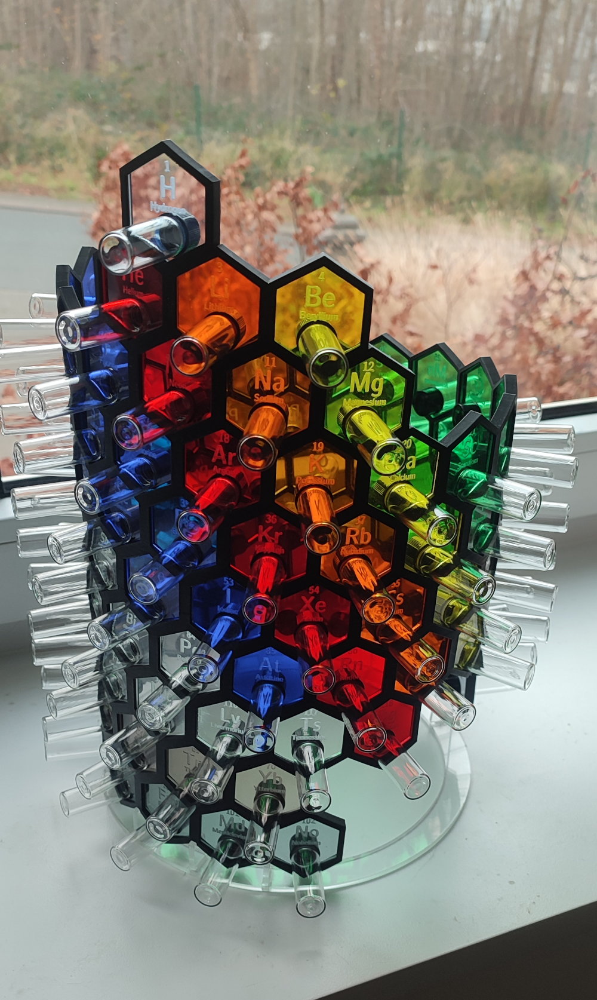

# Periodic table hexagon generator

The purpose of this small script is to generate hexagon for a laser cutter to fill in a periodic table:


An hexagon look like this:


The design of an hexagon can be adapted.
The hexagons are divided in the following categories:
- actinide
- alkali metal
- alkaline earth metal
- hydrogen
- lanthanide
- noble gas
- non metal
- poor metal
- transition metal
For each category, a `.svg` and a `.dxf` will be created with all the elements of the category.

Inkscape is used to convert from the `.svg` to the `.dxf`.

You can install the requirements:
```
pip install -r requirements.txt
```

and use the script:
```
python3 hexagon.py
```
